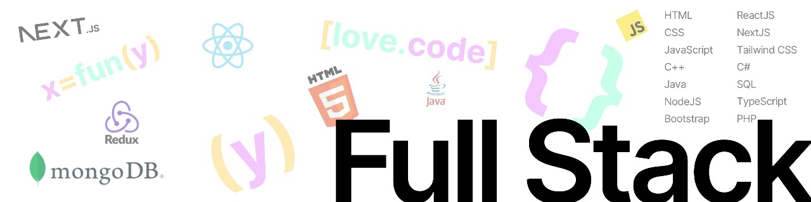

<h1 align="center"> </h1>
<h3 align="center">I'm a passionate developer with a strong interest in full-stack web development, particularly in building efficient, modern web applications that solve real-world problems.</h3>

  

  

- 🌱 I’m currently learning **Express.js, Next.js**

- 📫 How to reach me **codewith.shahriar1@gmail.com**

        

---

<!-- Proudly created with GPRM ( https://gprm.itsvg.in ) -->
